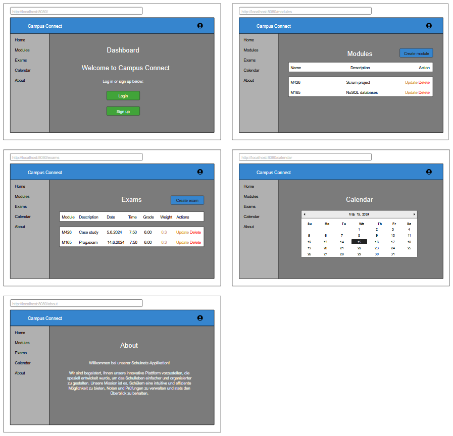

# Campus Connect

## :scroll: Inhaltsverzeichnis

1. [Einleitung](#1-einleitung)
   1. [Zielsetzung](#11-zielsetzung)
   2. [Themenwahl](#12-themenwahl)
   3. [Rollenverteilung](#13-rollenverteilung)
2. [Datenbank](#2-datenbank)
   1. [ERD](#21-erd)
3. [Mockup](#3-mockup)
4. [Komponentendiagramm](#4-komponentendiagramm)
   1. [Frontend](#41-frontend)
   2. [Backend](#42-backend)
   3. [Datenbank](#43-datenbank)
   4. [Interaktion](#44-interaktion)
5. [Funktionen](#5-funktionen)
6. [Projektplan](#6-projektplan)
   1. [Sprints](#61-sprints)
   2. [Stories und Tasks](#62-stories-und-tasks)

## 1. Einleitung

### _1.1 Zielsetzung_

Unser Ziel ist es, eine Schulnetz-Applikation zu erstellen, mit der Benutzer ihre eigenen Noten und Prüfungen einsehen und verwalten können. Die Applikation soll ausserdem einen Kalender enthalten, der einen Überblick über schulische Ereignisse bietet. Benutzer sollen sich registrieren und anschliessend einloggen können. Eine "About"-Seite, die alle Funktionalitäten im Überblick darstellt, soll ebenfalls realisiert werden. Designmässig streben wir ein minimalistisches Aussehen an; die Applikation soll einen Darkmode haben, und die Farben Weiss, Grau und Blau sollen dominieren. Ein eigenes Logo-Design ist ebenfalls geplant. Um die Applikation möglichst realitätsnah einsetzen zu können, planen wir, sie mithilfe von Docker zu deployen.

### _1.2 Themenwahl_

Die Umsetzung dieses Projekts wurde im Rahmen des Moduls "M426 - Software mit agilen Methoden entwickeln" beschlossen. Nach anfänglicher Ideensuche über 2D-Games und E-Shops bis hin zu einer Social-Media-Applikation haben wir uns für eine Schulnetz-Applikation entschieden. Der Grund dafür war, dass wir die Umsetzung dieses Projekts als realistisch erachteten. Die Technologien, die wir für die Umsetzung benötigen (Vue, Swagger, ExpressJS, PostgreSQL), sind uns fast alle bekannt, und wir haben bereits einige positive Erfahrungen damit gemacht. Die Funktionalitäten einer Schulnetz-Applikation lassen sich gut untereinander aufteilen, sodass jeder an seinem eigenen Bereich arbeiten kann, ohne die anderen zu stören.

### _1.3 Rollenverteilung_

Wir mussten für unser Projekt drei Rollen definieren: Scrum Master, Product Owner und Developer.  

**Scrum Master - Kyrylo-Tadei Krukenytskyi**  
Der Scrum Master sorgt dafür, dass das Scrum-Team die Prinzipien und Praktiken von Scrum versteht und anwendet. Er beseitigt Hindernisse, die den Fortschritt des Teams behindern, und fördert eine produktive und kollaborative Arbeitsumgebung. Ausserdem unterstützt er das Team dabei, kontinuierliche Verbesserungen durch regelmässige Retrospektiven zu erreichen.  
**Hauptaufgaben:** Design, Frontend-Entwicklung

**Product Owner - Kornel Duli**  
Der Product Owner ist verantwortlich für die Maximierung des Wertes des Produkts und das Management des Product Backlogs. Er kommuniziert die Vision des Produkts und die Anforderungen an das Entwicklungsteam, um sicherzustellen, dass die richtigen Funktionen implementiert werden. Er priorisiert die Aufgaben im Backlog basierend auf dem geschäftlichen Nutzen und den Bedürfnissen der Stakeholder.  
**Hauptaufgaben:** Projektbeschreibung, Erstellen von User Stories, Verwaltung des Backlogs, Planung von Sprints, Frontend-Entwicklung

**Developer(s) - Sebastian Auf der Maur & Daniel Bernet**  
Die Developer sind die Mitglieder des Scrum-Teams, die für die Umsetzung und Lieferung der Produktinkremente verantwortlich sind. Sie planen, entwickeln, testen und dokumentieren die Software und arbeiten eng zusammen, um die Sprint-Ziele zu erreichen. Zudem sind sie für die Qualität ihrer Arbeit und die Einhaltung der Definition of Done verantwortlich.  
**Hauptaufgaben:** Aufsetzung der Datenbank, Design, Backend- und Frontend-Entwicklung, Deployment

## 2. Datenbank

### _2.1 ERD_

Unser ERD hat Beziehungen zwischen drei Entitäten: User, Module und Exam. Es gibt zwei Beziehungen: Erstens hat ein User eine 1-zu-N-Beziehung zu einem Module, und zweitens hat ein Module eine 1-zu-N-Beziehung zu einem Exam. Diese Struktur ermöglicht es, dass ein Benutzer mehrere Module und jedes Modul mehrere Prüfungen haben kann. Die Beziehungen und Attribute sind so gestaltet, dass die Datenintegrität und -konsistenz gewährleistet ist.

## 3. Mockup

## 4. Komponentendiagramm

### _4.1 Frontend_

**1. User:** Der Benutzer interagiert direkt mit der Benutzeroberfläche der Applikation.

**2. main.js:** Dies ist der Einstiegspunkt für das Frontend der Applikation. Es lädt und initialisiert die Anwendung mit Vue und Vuetify.

**3. index.js:** Hier werden verschiedene Routen und Konfigurationen für die Anwendung definiert. Es verbindet die verschiedenen Komponenten und Views.

**4. components:** Diese beinhalten wiederverwendbare UI-Komponenten, die in verschiedenen Teilen der Applikation genutzt werden können.

**5. views:** Views sind spezifische Seiten oder Ansichten der Applikation, die dem Benutzer angezeigt werden.

**6. app.vue:** Dies ist die Haupt-Vue-Komponente, die die gesamte Anwendung strukturiert und andere Komponenten und Views einbindet.

### _4.2 Backend_

**1. Swagger:** Swagger ist ein Tool, das zur Dokumentation und Testen der API verwendet wird. Es ermöglicht Entwicklern, die API-Endpunkte zu verstehen und zu nutzen.

**2. server.js:** Dies ist der Hauptserver für das Backend, implementiert mit ExpressJS. Es leitet Anfragen zu den entsprechenden Routen weiter.

**3. routes:** Routen definieren die verschiedenen Endpunkte der API, die vom Frontend aufgerufen werden können.

**4. models:** Modelle repräsentieren die Datenstrukturen und Geschäftslogik der Applikation und interagieren direkt mit der Datenbank.

### _4.3 Datenbank_

**1. PostgreSQL:** PostgreSQL ist die relationale Datenbank, die für die Speicherung und Verwaltung der Applikationsdaten verwendet wird. Sie interagiert mit den Modellen im Backend, um Daten zu speichern und abzurufen.

### _4.4 Interaktion_

1. Der Benutzer sendet Anfragen über die Benutzeroberfläche, die durch main.js und index.js geleitet und von den entsprechenden Komponenten und Views verarbeitet werden.  
2. Anfragen vom Frontend gehen über Swagger zum Backend-Server (server.js), wo sie an die definierten Routen (routes) weitergeleitet werden.  
3. Die Routen verwenden Modelle (models), um mit der PostgreSQL-Datenbank zu interagieren und die notwendigen Daten zu speichern oder abzurufen.  
4. Die Ergebnisse dieser Datenbankoperationen werden zurück durch das Backend an das Frontend gesendet, wo sie in den entsprechenden Views angezeigt werden.

## 5. Funktionen

**1. Login:** Diese Funktion ermöglicht es Benutzern, sich mit ihren Anmeldeinformationen in die Applikation einzuloggen. Benutzer geben ihre Zugangsdaten ein und erhalten Zugriff auf ihre personalisierten Inhalte.

**2. Signup:** Diese Funktion erlaubt es neuen Benutzern, sich für die Applikation zu registrieren. Sie erstellen ein neues Konto, indem sie die erforderlichen Informationen wie Benutzername, und Passwort angeben.

**3. Logout:** Die Logout-Funktion ermöglicht es Benutzern, sich sicher von ihrem Konto abzumelden. Dadurch wird sichergestellt, dass ihre Sitzungsdaten gelöscht und ihre Privatsphäre geschützt werden.

**4. Create module:** Mit dieser Funktion können Benutzer neue Module hinzufügen. Sie geben den Namen und eine Beschreibung des Moduls ein und speichern diese Informationen. Die hinzugefügten Module werden in einer Liste angezeigt.

**5. Update module:** Bei Bedarf kann ein Modul aktualisiert werden.

**6. Delete module:** Bei Bedarf kann ein Modul gelöscht werden.

**7. Create exam:** Diese Funktion ermöglicht es Benutzern, neue Prüfungen zu erstellen. Benutzer geben Details wie Modulname, Beschreibung, Datum, Uhrzeit, Gewichtung und Note ein. Die erstellten Prüfungen werden in einer Liste angezeigt.

**8. Update exam:** Bei Bedarf kann eine Prüfung aktualisiert werden.

**9. Delete exam:** Bei Bedarf kann eine Prüfung gelöscht werden.

## 6. Projektplan

### _6.1 Sprints_

### _6.2 Stories und Tasks_

